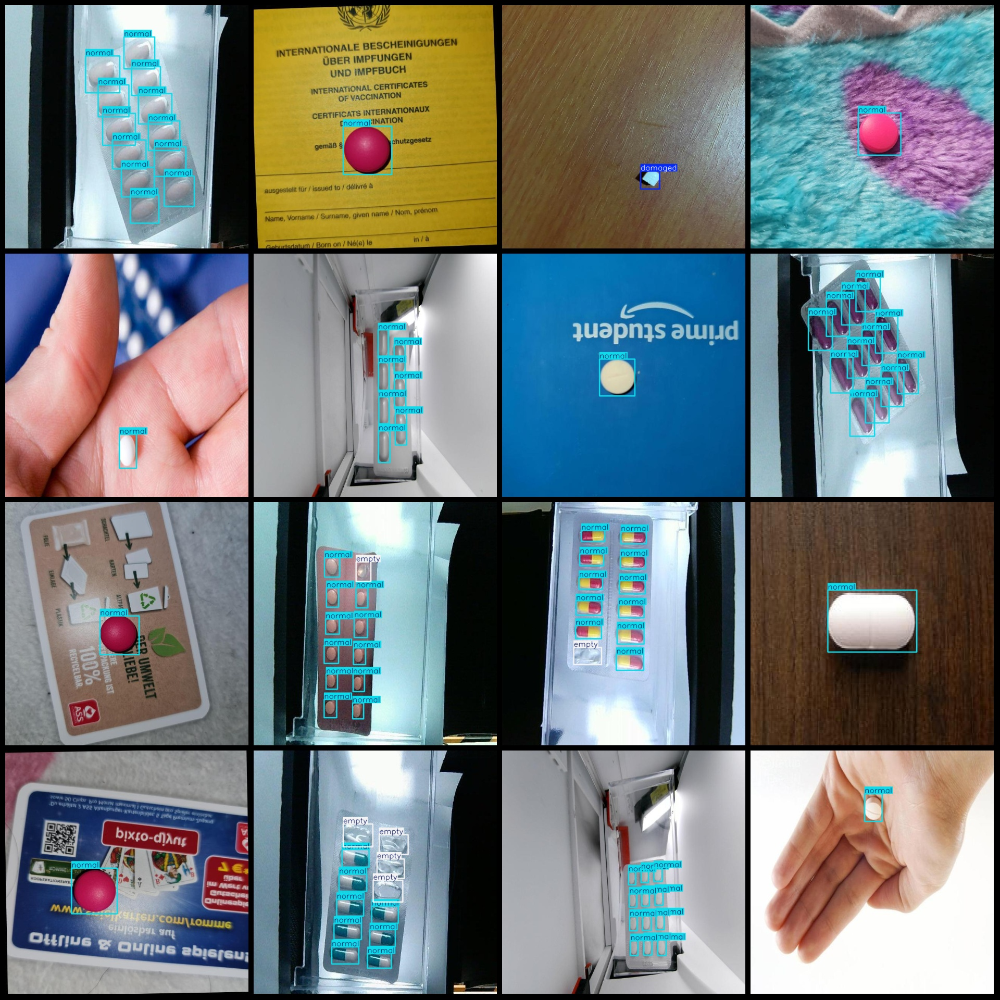

# Medicine Capsules Empty and Damaged Detection Dataset in VOC+YOLO format with 2930 images in three categories

Please note that some images in the dataset have been enhanced.
The dataset format: Pascal VOC format + YOLO format (txt file without split path, only containing jpg images and corresponding VOC format xml files and yolo format txt files).
Number of image files (jpg count): 2930
Count of annotations (xml files): 2930
Count of annotations (txt files): 2930
Count of annotation categories: 3
Annotation category names (notice that the order of categories in the yolo format is not consistent with this, but according to the labels folder's classes.txt): ["damaged", "empty", "normal"]
Box count for each category:
Damaged (broken) boxes = 531, occupying 348 images
Empty (vacant) boxes = 4826, occupying 1059 images
Normal (normal) boxes = 15810, occupying 2442 images
Total boxes: 21167
Image resolution: 640x640
Annotation tool used: labelImg
Annotation rules: draw bounding boxes for categories
Important note: The dataset does not have a training/validation/test split; you need to divide it yourself.
Special declaration: This dataset does not guarantee the accuracy of models or weight files trained on it.
Image previews:
Annotation example:
## Images

Here is a pay link on Stripe ( https://buy.stripe.com/3cs8yP7sY87d0vu9AB ). Please contact me lonlonago@foxmail.com after funding $89, and I will send you a complete data files , thank you!

